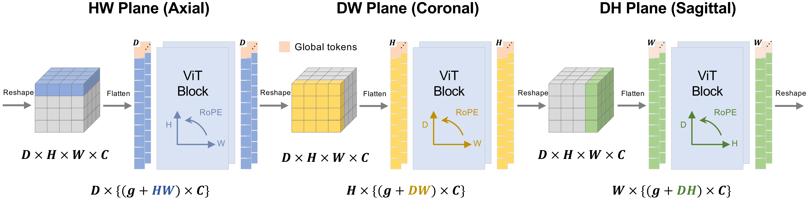

# PlaneCycle

PlaneCycle: Training-Free 2D-to-3D Lifting of Foundation Models Without Adapters ([arXiv](https://arxiv.org/abs/2603.04165))

## Overview

<div align="center">
  
  <p align="center" style="max-width: 800px; margin: 0 auto;">
    <i>
      <b>PCA visualizations of frozen lifted DINOv3 features.</b><br/>
      Evaluated on three 3D datasets across HW, DW, and DH planes (inconsistencies circled).
    </i>
  </p>
</div>

<br/>
<br/>

<div align="center">
  
  <p align="center" style="max-width: 800px; margin: 0 auto;">
    <i>
      <b>Overview of PlaneCycle across three orthogonal planes (HW, DW, DH).</b><br/>
      Flattened slice tokens are processed by shared ViT layers with plane-specific RoPE.
    </i>
  </p>
</div>

<br/>


## Pretrained Backbones 

To integrate **PlaneCycle** with **DINOv3**, configure the following parameters in the converter.

### Key Parameters

- **`cycle_order`**  
  Defines the sequence of spatial planes used for feature aggregation.

  - Default (used in the paper):`('HW', 'DW', 'DH', 'HW')`
  - Alternative:`('HW', 'DW', 'DH')`
- **`pool_method`**  
  Specifies how global tokens are aggregated across planes.

  - **`"PCg"`** (default): Uses adaptive pooling to preserve spatial token structure.
  - **`"PCm"`**: Uses mean pooling to obtain a global volumetric representation.

### Example

```python
import torch
from planecycle.converters.dinov3_converter import Dinov3Convertor

REPO_DIR = <PATH/TO/DINOV3/REPOSITORY>

x = torch.randn(2, 3, 64, 256, 256) # （N, 3, D, H, W）

# Load a DINOv3 ViT backbone pretrained on web images
model = torch.hub.load(
    REPO_DIR,
    "dinov3_vits16",
    source="local",
    weights=<CHECKPOINT/URL/OR/PATH>
)

# Convert the 2D backbone into a 3D PlaneCycle model
model = Dinov3Convertor(
    backbone=model,
    cycle_order=('HW', 'DW', 'DH', 'HW'),
    pool_method="PCg"
)

out = model(x)

cls_token = out["x_norm_clstoken"]
patch_tokens = out["x_norm_patchtokens"]
```
## Code Structure

- **`planecycle/`**  
  Core implementation of the PlaneCycle framework.

  - **`operators/`** – Implementation of the PlaneCycle operators.
  - **`converters/`** – Converters for adapting pretrained ViT backbones.

- **`models/`**

  - **`vision_transformer/`** – Modified Vision Transformer implementation used in this project.

- **`experiments/`**  
  Scripts for running experiments and reproducing results.

  - **`medmnist/`** – Training and benchmarking pipelines for six 3D MedMNIST+ datasets.
