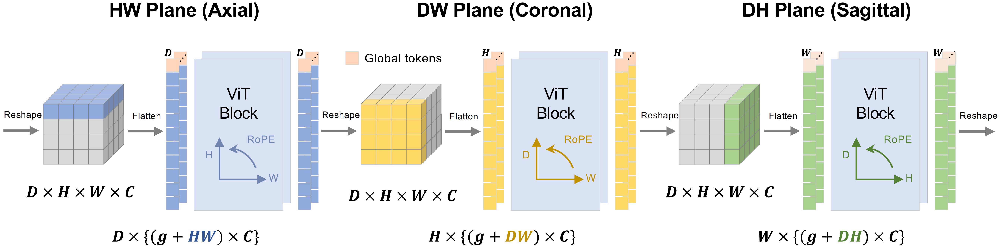

# PlaneCycle

PlaneCycle: Training-Free 2D-to-3D Lifting of Foundation Models Without Adapters ([arXiv](https://arxiv.org/abs/2603.04165))

> 🚀 **Coming soon:** A unified operator for ViTs and CNNs *(tests already passed, full release on the way!)*

## Overview

<div align="center">
  
  <p align="center" style="max-width: 800px; margin: 0 auto;">
    <i>
      <b>PCA visualizations of frozen lifted DINOv3 features.</b><br/>
      Evaluated on three 3D datasets across HW, DW, and DH planes (inconsistencies circled).
    </i>
  </p>
</div>

<br/>
<br/>

<div align="center">
  
  <p align="center" style="max-width: 800px; margin: 0 auto;">
    <i>
      <b>Overview of PlaneCycle across three orthogonal planes (HW, DW, DH).</b><br/>
      Flattened slice tokens are processed by shared ViT layers with plane-specific RoPE.
    </i>
  </p>
</div>

<br/>

## Pretrained Models
We utilize DINOv3 as the backbone for our 2D-to-3D lifting. 
DINOv3 Weights: Please follow the official repository [facebookresearch/dinov3](https://github.com/facebookresearch/dinov3) to download the pretrained checkpoints.

## Requirements
Our code is built on top of the DINOv3 framework. 
1. DINOv3 Environment: Follow the [installation guide](https://github.com/facebookresearch/dinov3) to set up the basic dependencies.
2. Additional Packages: medmnist, transformers

All experiments are conducted on a single NVIDIA H200 GPU (141GB memory). 

Memory requirements on MedMNIST datasets are detailed in the paper:
- Linear Probing: <10GB
- Fine-Tuning: 17GB (ViT-S), 33GB (ViT-B), 87GB (ViT-L)

Memory requirements on LIDC & MMWHS dataset:
- Linear Probing: 17GB (ViT-S), 18GB (ViT-B), 32GB (ViT-L)
- Fine-Tuning: 32GB (ViT-S), 44GB (ViT-B), 87GB (ViT-L)

## PlaneCycle Converter

Configure the following parameters in the converter.

### Key Parameters

- `cycle_order` Specifies the sequence of spatial planes for feature aggregation.
  Each block can be assigned a plane from `('HW', 'DW', 'DH').

  * Default (Paper): `('HW', 'DW', 'DH', 'HW')`
  * Alternatives: Support any order, e.g., `('HW', 'DW', 'DH')` or `('HW', 'DH', 'DW')`, or even define different planes for each block. 

- `pool_method`  
  Specifies how global tokens are aggregated across planes.

  - `"PCg"` (default): Uses adaptive pooling to preserve spatial token structure.
  - `"PCm"`: Uses mean pooling to obtain a global volumetric representation.

### Example

```python
import torch
from planecycle.converters.converter import PlaneCycleConverter

x = torch.randn(2, 3, 64, 256, 256) # （N, 3, D, H, W）

# Load a DINOv3 ViT backbone pretrained on web images
backbone = torch.hub.load('facebookresearch/dinov3', 'dinov3_vitb16')

# Convert the 2D backbone into a 3D PlaneCycle model
model = PlaneCycleConverter(model)

out = model(x)
```

## Code Structure

- `planecycle/`  
  Core implementation of the PlaneCycle framework.

  - `operators/` – Implementation of the PlaneCycle operators.
  - `converters/` – Converters for adapting pretrained ViT backbones.

- `models/`

  - `vision_transformer/` – Modified Vision Transformer implementation used in this project.

- `experiments/`  
  Scripts for running experiments and reproducing results.

  - `medmnist/` – Training and benchmarking pipelines for six 3D MedMNIST+ datasets.

## How to run the experiments
* six 3D classification datasets(./experiments/medmnist/train_eval.py)
